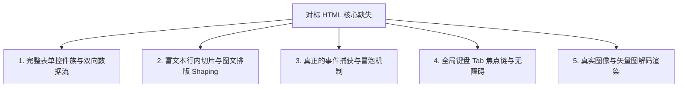

# Rust CSS-Like 缺陷审查与 HTML / CSS / PHP 深度对齐路线图白皮书

> **文档定位**：本文档对 `rust_css_like` 项目现有架构进行深度的工程缺陷审查（Defect Audit），并详尽剖析系统若要与成熟的 **HTML（结构与控件）**、**CSS（层叠与渲染）** 和 **PHP（模板与全栈数据）** 深度集成与对齐，当前仍然缺失的核心机制与能力缺口，最后给出阶段性的补全演进路线。

---

## 目录
1. [当前系统核心缺陷与占位符全景审查](#一-当前系统核心缺陷与占位符全景审查)
   - [1.1 无法运行与缺少应用入口 (No Bin / App Shell)](#11-无法运行与缺少应用入口-no-bin--app-shell)
   - [1.2 虚假的 CI/CD 演练场与出包脚本](#12-虚假的-cicd-演练场与出包脚本)
   - [1.3 缺少底层上屏光栅化驱动 (Render Backend 缺画笔)](#13-缺少底层上屏光栅化驱动-render-backend-缺画笔)
   - [1.4 布局引擎未形成整树闭环 (Taffy 桥接未串联)](#14-布局引擎未形成整树闭环-taffy-桥接未串联)
   - [1.5 脚本引擎缺少 AST 与运算符优先级 (Fake Script Evaluator)](#15-脚本引擎缺少-ast-与运算符优先级-fake-script-evaluator)
   - [1.6 假 SQLite 数据库驱动 (Mock SQL Executor)](#16-假-sqlite-数据库驱动-mock-sql-executor)
   - [1.7 缺少操作系统窗口与原生事件循环](#17-缺少操作系统窗口与原生事件循环)
2. [对标 HTML：缺失的原语、控件族与文档模型](#二-对标-html缺失的原语控件族与文档模型)
3. [对标 CSS：缺失的选择器、动态计算与渲染机制](#三-对标-css缺失的选择器动态计算与渲染机制)
4. [对标 PHP：缺失的模板流、标准函数库与数据持久化](#四-对标-php缺失的模板流标准函数库与数据持久化)
5. [四大技术栈能力对照矩阵](#五-四大技术栈能力对照矩阵)
6. [分阶段落地实施路线图 (Actionable Roadmap)](#六-分阶段落地实施路线图-actionable-roadmap)

---

## 一、 当前系统核心缺陷与占位符全景审查

经过对全部 12 个子模块以及根目录配置的严格审查，系统当前呈现**“顶层数据结构完备，底层核心驱动大面积为桩代码（Stubs / Mocks）”**的状态。

### 1.1 无法运行与缺少应用入口 (No Bin / App Shell)
* **现状**：整个 Workspace 的 12 个子模块全部为 `lib.rs` 纯函数库。
* **致命缺陷**：仓库中**没有任何一个 `src/main.rs` 或 `[[bin]]` 可执行目标**。用户无法在本地执行 `cargo run` 弹出一个窗口来查看任何实际渲染效果。

### 1.2 虚假的 CI/CD 演练场与出包脚本
* **`preview-wasm.yml` 伪装演练场**：
  在 `.github/workflows/preview-wasm.yml` 中，名为 `Build WASM Core` 的步骤实际只是用 `cat << 'EOF' > public/index.html` 写入了一个纯静态网页，并在里面硬编码了一个带有 `.canvas-mock` 样式的虚线框。**它根本没有运行 `wasm-pack build`，没有任何 WebAssembly 编译与加载逻辑**。
* **`build-native.yml` 空包**：
  构建脚本尝试打包 `target/release/*.exe` 以及 `target/.../app-shell`。但由于没有 bin target，构建命令只能编译出一堆 `.rlib` 库文件，最终打出来的 Release 压缩包**完全为空**。

### 1.3 缺少底层上屏光栅化驱动 (Render Backend 缺画笔)
* **现状**：`render-backend` 定义了 `DrawCommand` 图元指令与 `DisplayList` 队列。
* **致命缺陷**：系统目前只有“记录想画什么”，没有任何“怎么画出来”的画笔。既没有接入 `wgpu`（GPU 硬件加速管线），也没有接入 `tiny-skia` / `femtovg`（CPU 软件光栅化），物理显存中没有任何像素产出。

### 1.4 布局引擎未形成整树闭环 (Taffy 桥接未串联)
* **现状**：`layout-engine` 的 `LayoutBridge::to_taffy_style` 仅实现了**单个节点样式**向 `taffy::style::Style` 的转换。
* **致命缺陷**：缺少树形遍历调度器。尚未将虚拟 DOM 树（`ElementTree`）的所有子节点递归注入 `taffy::TaffyTree`，也未将 Taffy 解算出的全局坐标回填更新到各节点的 `LayoutRect`，目前无法根据窗口尺寸进行自动流式排版。

### 1.5 脚本引擎缺少 AST 与运算符优先级 (Fake Script Evaluator)
* **现状**：`script-engine::eval` 仅靠 `strip_prefix`、字符串截取和简单的哈希表查找。
* **致命缺陷**：缺少通用的 Pratt 语法解析器或逆波兰算法（Shunting-Yard）。无法计算四则混合运算（如 `1 + 2 * 3` 优先级会被打乱或报错），不支持比较运算符（`count > 5`），不支持三元表达式的动态条件判定。

### 1.6 假 SQLite 数据库驱动 (Mock SQL Executor)
* **现状**：`data-bridge::sqlite_local` 中的 `EmbeddedDatabase` 使用内存 `HashMap` 模拟表。
* **致命缺陷**：
  ```rust
  if sql.to_uppercase().starts_with("INSERT") { Ok(1) }
  ```
  `execute` 仅判断 SQL 是否以 `INSERT` 或 `DELETE` 开头；`query` 永远返回写死的 `"示例数据记录"`。没有真正链接原生 SQLite C 库（`sqlite3.c`）或 `rusqlite`，不支持任何真实条件查询（`WHERE`）与事务支持。

### 1.7 缺少操作系统窗口与原生事件循环
* **现状**：`render-backend::ime` 定义了 `ImeCursorAnchor`，但没有调用任何系统 API。
* **致命缺陷**：缺少基于 `winit` 或 `sdl2` 的操作系统窗口事件泵。操作系统的真实鼠标移动、点击、键盘打字、IME 候选词定位（Windows `ImmSetCandidateWindow`）完全没有与引擎打通。

---

## 二、 对标 HTML：缺失的原语、控件族与文档模型

HTML 经历了几十年的演进，其核心能力不仅在于“声明标签”，更在于**完整的表单交互协议、富文本图文混排与事件冒泡机制**。当前系统对标 HTML 仍缺失：



### 1. 完整表单控件族与双向数据流 (Form Controls & Two-Way Binding)
* **缺失**：
  - 虽然在 `ElementTag` 中声明了 `Checkbox`, `Select`, `Option`, `Slider` 等枚举，但目前**没有任何内部状态流**。
  - 缺少复选框的勾选态切换、单选框（Radio）的互斥分组管理。
  - 缺少下拉选择框（Select）的展开遮罩层（Popup Overlay）与选项高亮。
  - 缺少表单（`<form>`）序列化与数据重置校验机制。

### 2. 富文本行内切片与图文排版 (Inline Spans & Text Shaping)
* **缺失**：
  - HTML 中最常见的“单行内部分加粗、部分带颜色、内嵌小图标或超链接 `<a>`”在当前引擎中无法表达。当前节点的文本排版属性是节点级独占的。
  - 缺少基于 **HarfBuzz / FreeType / cosmic-text** 的字符塑形（Text Shaping）与双向文本分词断行算法（Word Wrapping），无法根据文本长度自适应测量容器高宽。

### 3. 完整的事件捕获与冒泡机制 (Event Bubbling & Capturing)
* **缺失**：
  - 当前只有 `HitTester` 找出的最上层节点（topmost node）。
  - 缺少标准 DOM 事件流：`Capturing (捕获) -> Target (目标) -> Bubbling (冒泡)`。
  - 无法实现父容器捕获事件、`e.stopPropagation()` 阻止冒泡或 `e.preventDefault()` 阻止默认行为。

### 4. 全局键盘 Tab 焦点链 (Focus Navigation & Tab Index)
* **缺失**：
  - 桌面软件强依赖键盘操作。当前缺少全局焦点链管理器（Focus Chain），无法通过 Tab 键在各输入框和按钮间流转高亮。
  - 缺少输入框内的**文本光标闪烁（Caret Blink）**与**鼠标拖拽划选高亮（Text Selection）**。

### 5. 真实图像与矢量图解码渲染 (Image & SVG Pipeline)
* **缺失**：
  - 虽然定义了 `ElementTag::Image`，但没有集成任何 PNG/JPEG 解码器（如 `image` crate）或 SVG 矢量路径解析器（如 `usvg` / `tiny-skia`）。

---

## 三、 对标 CSS：缺失的选择器、动态计算与渲染机制

CSS 的威力在于强大的**选择器引擎、动态数学约束与层叠上下文**。当前系统对标 CSS 仍缺失：

### 1. 选择器匹配引擎 (Selector Matching Engine)
* **现状**：当前系统只支持直接将样式内嵌在标签块中，或靠单纯的标签名称匹配。
* **缺失**：
  - **类选择器** (`.card`, `.btn-primary`)
  - **ID 选择器** (`#main-header`)
  - **属性选择器** (`input[type="text"]`, `[disabled]`)
  - **层级关系选择器**：子代选择器 (`>`)、后代选择器 (空格)、相邻兄弟选择器 (`+`)
  - **结构伪类**：`:nth-child(2n)`, `:first-child`, `:last-child`

### 2. `calc()` 动态混合计算与进阶数学函数
* **现状**：`Dimension` 枚举只能在 `Px`、`Percent`、`Auto` 三者之间单选。
* **缺失**：
  - 无法执行混合运算：`width: calc(100% - 32px)`。
  - 缺少现代 CSS 标配数学函数：`min()`, `max()`, `clamp(12px, 2vw, 24px)`。这导致界面在大屏与小屏切换时难以实现真正精致的自适应。

### 3. 伪元素虚拟盒子 (`::before` / `::after`)
* **缺失**：
  - 无法直接通过样式在组件前后自动附着装饰性图形、小圆点红点徽章或自定义图标，必须手动在 DSL 中多写几个无意义的结构标签。

### 4. 树形层叠上下文与局部 Z-Index 树 (Stacking Context)
* **现状**：当前仅做全局扁平的 `z_index: i32` 比较。
* **缺失**：
  - CSS 真正的 Z-Index 机制依赖于局部层叠上下文（受父级 `opacity < 1`、`transform`、`clip` 影响）。子元素的 Z-Index 永远不能穿透更高层级的父元素层叠上下文。

### 5. 作用域变量继承与动态回退 (CSS Variable Scoping)
* **现状**：`VariableTable` 目前是全局一张扁平的哈希表。
* **缺失**：
  - CSS 变量（`--color`）具有树形继承能力，某个组件内部覆盖 `--color: red` 应该仅作用于其子树，而不会污染全局其他同名变量。
  - 缺少变量回退求值：`var(--primary, #4f46e5)`。

### 6. 双阶段内在尺寸测量 (Intrinsic Sizing: `min-content` / `max-content`)
* **缺失**：
  - 排版阶段需要两趟遍历（Measure & Layout）：子元素先根据内容汇报自己的最小/最大内容尺寸，父容器再根据空间分配约束。当前缺少文本与子树的测量反馈闭环。

---

## 四、 对标 PHP：缺失的模板流、标准函数库与数据持久化

项目在顶层设计中借鉴了 PHP 的思想（模板直插 `$var`、直连数据库、控制流语法、`@import` 模块化）。当前对标 PHP 仍缺失：

### 1. 跨文件模块引入与组件宏展开机制 (`@import` & `component`)
* **现状**：AST 中解析出了 `ScopeKind::Import` 和 `ScopeKind::ComponentDef`，但仅仅停留在 AST 节点阶段。
* **缺失**：
  - **文件解析器（File Resolver）**：根据相对路径/绝对路径读取磁盘文件并缓存防重。
  - **组件宏展开（Component Expander）**：定义 `component Card(title, desc)` 后，缺少将 `<Card title="任务" desc="详情" />` 实例化并将其内部形参替换为真实实参的树展开逻辑。

### 2. 强大的内置工具函数标准库 (Built-in Stdlib)
* **现状**：当前 `Evaluator` 仅写死了 `len()` 和 `trim()` 两个函数。
* **缺失**：
  - **字符串函数族**：`substr`, `replace`, `split`, `upper`, `lower`, `starts_with`, `ends_with`, `format`
  - **集合/数组函数族**：`map`, `filter`, `reduce`, `push`, `pop`, `contains`, `sort_by`, `reverse`
  - **日期与时间函数族**：`now()`, `date_format()`
  - **序列化与协议函数族**：`json_encode`, `json_decode`
  - **数学函数族**：`abs`, `round`, `floor`, `ceil`, `random`

### 3. 会话管理与配置持久化存储 (Session / LocalStorage)
* **缺失**：
  - PHP 原生提供 `$_SESSION`，前端拥有 `localStorage`。对于桌面端客户端，窗口上次关闭时的坐标尺寸、用户登录 Token、自定义偏好主题，必须有开箱即用的轻量级单文件持久化存储层（如 SQLite 或 JSON 自动写盘）。

### 4. 真正的 ACID 事务与参数化预编译 (Prepared Statements)
* **缺失**：
  - 在 `app.ui` 中写道：`db.execute("INSERT ... VALUES (?)", [new_task_input])`。
  - 目前缺少真正的参数化占位符替换（防注入）、连接池生命周期管理、以及 `BEGIN` / `COMMIT` / `ROLLBACK` 事务保障。

---

## 五、 四大技术栈能力对照矩阵

| 功能维度 | 当前 `rust_css_like` 现状 | 对标 HTML | 对标 CSS | 对标 PHP |
| :--- | :--- | :--- | :--- | :--- |
| **基础语法与标记** | 零样板头，纯 `{}` 约束作用域 | 标签闭合 `<div></div>` | 选择器 `{ 属性: 值 }` | `<?php echo $var; ?>` 模板插值 |
| **可执行性** | ⚠️ **仅库代码，缺少 main.rs 入口** | 浏览器直接渲染 | 浏览器直接渲染 | PHP CLI / Web Server 执行 |
| **绘制呈现** | ⚠️ **只有 DisplayList 指令，无上屏画笔** | 浏览器内置光栅化 | 浏览器内置光栅化 | 服务端生成 HTML，交浏览器渲染 |
| **布局排版** | ⚠️ **仅桥接单节点，未打通整树 Taffy** | 完整盒模型流式排版 | Flex / Grid / 绝对定位 | N/A (不涉及排版) |
| **表单与状态** | ⚠️ **有 Tag 枚举，无控件状态流** | 完整表单控件族与双向流 | 伪类 `:checked`, `:focus` | `$_POST`, `$_GET` 数据接收 |
| **富文本与排版** | ⚠️ **整块纯文本，无行内混排** | 内联 `<span>`, `<b>`, `<a>` | 字体塑形、自动换行、截断 | 字符串拼接输出 |
| **数学计算** | ⚠️ **仅支持单一 Px / Percent** | N/A | `calc()`, `clamp()`, `min/max` | 完整四则混合运算与数学库 |
| **模块复用** | ⚠️ **AST 有 Import/Component，无展开器** | `<template>`, Web Components | `@import`, CSS Modules | `include`, `require`, 命名空间 |
| **脚本与表达式** | ⚠️ **字符串匹配，无优先级 AST** | JavaScript 完整语言运行时 | N/A | 完整动态解释语言 |
| **本地数据存储** | ⚠️ **内存表 Mock，字符串前缀匹配** | `localStorage`, `IndexedDB` | N/A | PDO / SQLite3 原生完整支持 |
| **云端在线体验** | ⚠️ **CI 生成虚假静态 HTML 页面** | 网页原生支持 | 网页原生支持 | 在线 PHP Sandbox 真实执行 |

---

## 六、 分阶段落地实施路线图 (Actionable Roadmap)

为了将当前的“框架骨架”全面做实，建议按照以下六个阶段系统性推进：

```
[阶段 1：打通可运行应用壳与底层光栅化上屏] (优先级最高，让引擎看得见)
  ├─ 1.1 新增 crates/app-shell (或 examples/desktop_runner)，编写 main.rs
  ├─ 1.2 引入 winit 接入真实操作系统原生窗口与事件循环
  ├─ 1.3 在 render-backend 中接入 tiny-skia (纯CPU) 或 wgpu (GPU)，真正绘制 DisplayList 像素
  └─ 1.4 修复 preview-wasm.yml：使用 wasm-bindgen + wasm-pack 编译真实核心，挂载 Canvas 渲染

[阶段 2：打通虚拟 DOM 到 Taffy 的整树排版递归闭环]
  ├─ 2.1 编写 ElementTree -> TaffyTree 递归节点树构建器
  ├─ 2.2 执行 taffy.compute_layout() 并将绝对 LayoutRect 递归回填到每个虚拟节点
  └─ 2.3 窗口尺寸变化时触发 Relayout 脏刷新并重新分配尺寸

[阶段 3：做实脚本引擎解释器与标准函数库]
  ├─ 3.1 基于 Pratt 解析器重构 script-engine::eval，支持 1 + 2 * 3 运算符优先级与括号嵌套
  ├─ 3.2 扩充标准库函数：字符串 (substr, split)、集合 (map, filter)、时间 (now)
  └─ 3.3 实现三元表达式 a ? b : c 与比较运算 (> < == !=)

[阶段 4：做实嵌入式 SQLite 真实驱动]
  ├─ 4.1 在 data-bridge 中引入 rusqlite (bundled 特性，零环境依赖)
  ├─ 4.2 实现参数化绑定执行与真实单文件 .db 自动持久化
  └─ 4.3 完善本地任务清单 app.ui 的增删改查真实闭环

[阶段 5：与 HTML / CSS 核心能力对齐]
  ├─ 5.1 在 element-core 中实现 Checkbox / Select / Option 的激活态与下拉遮罩层
  ├─ 5.2 引入 cosmic-text 或 parley 解决单行富文本 Span 混排与字素测量断行
  ├─ 5.3 实现 calc(100% - 30px) 的排版期动态求解器
  └─ 5.4 补齐键盘 Tab 焦点链与 Win32 原生 IME 拼音输入法 API 绑定

[阶段 6：完善模块化与 AOT 安全加密链]
  ├─ 6.1 实现 @import 的磁盘递归解析器与 component 模版宏实参展开
  └─ 6.2 完善 .binui 二进制打包器与加密流离线生成 CLI
```

---
*本白皮书已同步写入工作区根目录 [DEFECTS_AND_ALIGNMENT_ROADMAP.md](file:///d:/for_clone/rust_css_like/DEFECTS_AND_ALIGNMENT_ROADMAP.md)，供后续架构演进与团队开发查阅。*
