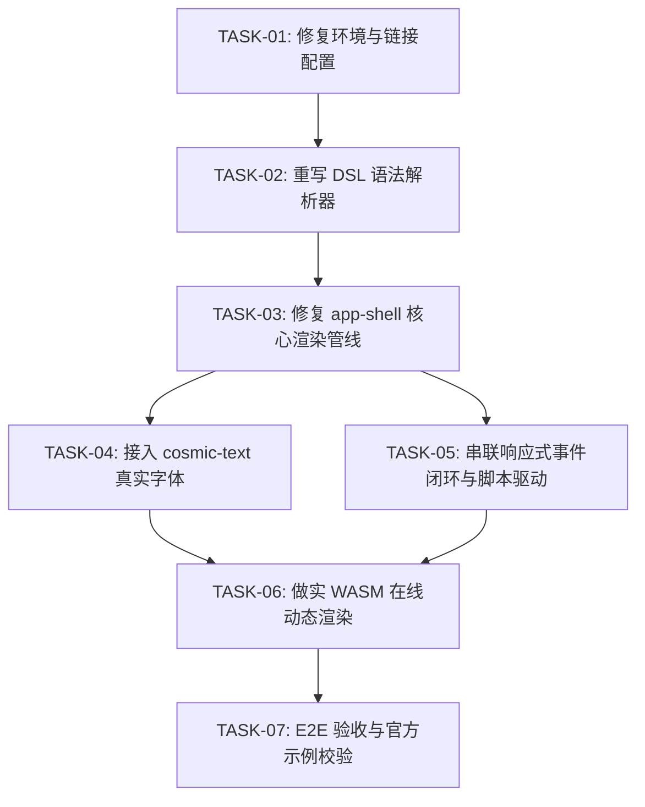

# 🛠️ Rust CSS-Like 生产级闭环落地实施指导书与任务工单库

> **文档定位**：面向接盘 AI Agent 的高精度实施指令与工单库（Implementation PRD & Actionable Task Tickets）。  
> **核心使命**：彻底消除项目中所有“障眼法”与“伪实现”，修复全链路断裂的 5 大核心管线，将 `rust_css_like` 推进至**“能解析官方示例、能呈现真实矢量文字排版、能响应点击进行响应式更新、能在 WASM 画布上动态渲染”**的真正完整状态。

---

## 目录
1. [现状诊断与致命断点基线 (Audit Baseline)](#一-现状诊断与致命断点基线-audit-baseline)
2. [终态验收标准 (Definition of Done)](#二-终态验收标准-definition-of-done)
3. [实施阶段与依赖拓扑 (Execution Topology)](#三-实施阶段与依赖拓扑-execution-topology)
4. [详细工程实施工单 (Task Tickets)](#四-详细工程实施工单-task-tickets)
   - [TASK-01 (P0): 修复 Windows 环境链接器与构建配置](#task-01-p0-修复-windows-环境链接器与构建配置)
   - [TASK-02 (P0): 重写与增强 DSL 词法及语法解析器 (彻底支持官方示例)](#task-02-p0-重写与增强-dsl-词法及语法解析器-彻底支持官方示例)
   - [TASK-03 (P0): 修复 app-shell 渲染管线 (打通 Window、文本与排版属性)](#task-03-p0-修复-app-shell-渲染管线-打通-window文本与排版属性)
   - [TASK-04 (P1): 真正接入 cosmic-text 实现真实矢量字体光栅化](#task-04-p1-真正接入-cosmic-text-实现真实矢量字体光栅化)
   - [TASK-05 (P1): 串联响应式状态机、事件泵与点击交互闭环](#task-05-p1-串联响应式状态机事件泵与点击交互闭环)
   - [TASK-06 (P2): 做实 WASM 在线演练场动态渲染管线](#task-06-p2-做实-wasm-在线演练场动态渲染管线)
   - [TASK-07 (P2): 端到端全链路集成测试与官方示例验证](#task-07-p2-端到端全链路集成测试与官方示例验证)
5. [用户一键分发给下个 Agent 的 Prompt 模板](#五-用户一键分发给下个-agent-的-prompt-模板)

---

## 一、 现状诊断与致命断点基线 (Audit Baseline)

经过严密审查，目前仓库虽然扩充至 15 个 Crate 且有 30 个局部单测，但**应用级主干链路完全是断裂的**。接盘 Agent **严禁**在此基础上继续伪造 Mock，必须对照以下 5 大断点逐一攻坚：

```
┌────────────────────────────────────────────────────────────────────────┐
│                        当前全链路核心断点现状                          │
├────────────────────────────────────────────────────────────────────────┤
│ 1. DSL 语法断裂:   Lexer 丢换行、Parser 强行要求 `{`，官方所有示例均无法解析 │
│ 2. 管线丢节点:     app-shell 忽略 ScopeKind::Window，DOM 树空置，文本永远为"Label"│
│ 3. 字体是方块:     FontAtlas 绘制实心矩形色块，cosmic-text 依赖声明了但零调用│
│ 4. 交互是假动作:   app-shell 没依赖 script-engine，鼠标点击事件不执行任何动作 │
│ 5. WASM 障眼法:    render_dsl_to_canvas 下划线丢弃输入，固定输出写死的卡片   │
└────────────────────────────────────────────────────────────────────────┘
```

* **断点 1 (语法解析)**：`crates/dsl-parser/src/parser.rs:65` 强制要求 `cursor+1 == OpenBrace`，导致 `col pad=32 {`、`win "Title" (400, 300) {` 和无花括号的 `txt "..."`、`btn "..." -> ...` 全部被静默抛弃。
* **断点 2 (管线装配)**：`crates/app-shell/src/pipeline.rs:54-64` 的 `convert_block` 丢弃了 `ScopeKind::Window`，且未将 DSL 字符串赋给 `ElementNode.text_content`，样式也仅处理了 5 个属性。
* **断点 3 (字体渲染)**：`crates/render-backend/src/font_atlas.rs:40-52` 只是用 `tiny-skia` 填充 `bar_rect`（微型黑色小长条），没有真实字体光栅化。
* **断点 4 (事件闭环)**：`crates/app-shell/src/event_pump.rs:45-49` 点击仅 `request_redraw`，未做 HitTest，未接通 `script-engine`。
* **断点 5 (WASM 沙箱)**：`crates/wasm-runtime/src/lib.rs:57-72` 的 `render_dsl_to_canvas` 丢弃 `_blocks`，硬编码白底卡片。

---

## 二、 终态验收标准 (Definition of Done)

当完成本计划书的所有任务后，系统必须达到以下可运行物理标准：
1. **本地运行**：在根目录下执行 `cargo run -p app-shell`：
   - 弹出一个 960x640 的系统原生视窗；
   - 成功加载并解析 `examples/counter.ui` 或 `examples/app.ui`；
   - 屏幕上渲染出正确的卡片、边距、按钮以及**清晰可见的真实抗锯齿文字**（非方块）；
   - 鼠标点击 “增加 (+1)” 按钮，计数器文字立即从 `当前计数: 0` 变为 `当前计数: 1`。
2. **WASM 运行**：浏览器打开 WASM 页面，在左侧编辑框输入任一合法的 `.ui` 语法片段，右侧 Canvas 能够根据输入动态重新排版并呈现真实的 DOM 树图形。
3. **测试覆盖**：新增端到端集成测试，通过 `cargo test --workspace` 全绿。

---

## 三、 实施阶段与依赖拓扑 (Execution Topology)



---

## 四、 详细工程实施工单 (Task Tickets)

---

### TASK-01 (P0): 修复 Windows 环境链接器与构建配置

* **目标**：解决 Windows 本地开发时由于 `.cargo/config.toml` 强制指定 `rust-lld` 导致缺少 `kernel32.lib` 报错的问题，确保本地与 CI 均能秒级编译与测试。
* **涉及文件**：
  - `.cargo/config.toml`
* **问题成因**：
  `.cargo/config.toml` 硬编码了 `rustflags = ["-C", "linker=rust-lld"]`。在未配置 MSVC 环境变量的 Windows 终端中，rust-lld 无法自动发现 Windows SDK 库路径。
* **实施方案**：
  1. 优化 `.cargo/config.toml`，移除对 `rust-lld` 的硬性全局劫持，允许系统使用默认链接器；或者提供跨平台条件配置。
  2. 验证运行 `cargo check --workspace` 能够顺利通过。
* **验收标准 (DoD)**：
  - 在当前开发机上直接运行 `cargo check --workspace` 无报错退出（返回 0）。

---

### TASK-02 (P0): 重写与增强 DSL 词法及语法解析器 (彻底支持官方示例)

* **目标**：让 `dsl-parser` 能够 100% 真实解析 `examples/counter.ui` 及 `examples/app.ui`。
* **涉及文件**：
  - `crates/dsl-parser/src/lexer.rs`
  - `crates/dsl-parser/src/token.rs`
  - `crates/dsl-parser/src/parser.rs`
  - `crates/dsl-parser/src/decl_parser.rs`
  - `crates/dsl-parser/src/ast.rs`
* **具体需求与核心逻辑**：
  1. **换行敏感与语句自动终结**：
     - 在 `Lexer` 中增加 `TokenKind::Newline`，或者根据换行符进行分号自动推导（Automatic Semicolon Insertion）。
     - 解析 `let count = 0` 时，遇到换行或分号即终结当前声明，严禁吞噬下一行！
  2. **元素块声明头支持内联属性**：
     - 重写 `parse_element_block`：允许语法形如 `tag [string_title] [size_tuple] [inline_props...] { children... }`。
     - 示例：`win "极简计数器应用" (400, 300) bg=#0f172a { ... }` 能够被正确解析为：
       - `kind: ScopeKind::Window`
       - 包含属性：`title="极简计数器应用"`, `width=400`, `height=300`, `bg=#0f172a`。
     - 示例：`col pad=32 gap=20 align=center { ... }` 能够正确提取 `pad`, `gap`, `align` 属性。
  3. **支持无花括号的行内叶子控件 (Leaf Statements)**：
     - 在 `parse_block_body` 中，支持行内单行元素：
       - `txt "当前计数: $count" #f8fafc 28px bold` -> 解析为 `Element("txt")`，包含文本内容与样式。
       - `btn "增加 (+1)" pad=(8, 16) bg=#4f46e5 rad=6 -> count += 1` -> 解析为 `Element("btn")`，包含属性及 `ActionCode("count += 1")`。
  4. **组件调用实参语法**：
     - 支持 `StatCard(title="Active Users", value="12,480")` 语法，由 `ComponentExpander` 自动展开。
* **验收标准 (DoD)**：
  - 编写集成单测：直接将 `examples/counter.ui` 的完整字符串送入 `parse_dsl`，成功解析出包含 Window、col、txt、row、btn 的完整 AST 树，无语法报错。

---

### TASK-03 (P0): 修复 app-shell 渲染管线 (打通 Window、文本与排版属性)

* **目标**：彻底打通从 `ScopeBlock AST` ──► `ElementTree` ──► `ComputedStyle` ──► `TaffyTree` ──► `DisplayList` 的主装配带。
* **涉及文件**：
  - `crates/app-shell/src/pipeline.rs`
  - `crates/element-core/src/node.rs`
  - `crates/layout-engine/src/tree_solver.rs`
* **具体需求与核心逻辑**：
  1. **支持 Window 根节点转换**：
     - 在 `convert_block` 中，正确处理 `ScopeKind::Window`，将其映射为 `ElementTag::Window` 挂载在根节点上，并递归处理其全部子节点。
  2. **提取并保存文本内容**：
     - 遇到 `txt` 或 `btn` 时，将其字面量内容存入 `node.set_text(...)`。
     - 在 `emit_draw_commands` 时，优先使用 `node.text_content`，杜绝任何硬编码的 `"Label"`。
  3. **完备映射 Flexbox 与 CSS 排版属性**：
     - 扩充 `prepare_styles`，将 inline styles 完整写入 `ComputedStyle`：
       - `pad=16` 或 `pad=(8, 16)` -> `padding`
       - `gap=12` -> `gap`
       - `flex=1` -> `flex_grow = 1.0`
       - `align=center` -> `align_items = AlignItems::Center`
       - `justify=center|between` -> `justify_content`
       - 字体属性：`28px` -> `font_size = 28.0`；`bold` -> `font_weight = Bold`。
  4. **Taffy 内在文本尺寸闭环**：
     - 在 `tree_solver.rs` 中，对 `ElementTag::Text` 节点，使用 `TextMeasurer::measure` 为其计算出 `min-content` / `max-content` / `natural_height`，并传递给 Taffy 作为节点的约束尺寸，杜绝文字尺寸在排版中被压缩为 0x0。
  5. **按钮复合物图元生成**：
     - 按钮元素在发射指令时，除了生成背景圆角矩形 `DrawRect` 外，如果带有文字，自动发射居中的 `DrawText`。
* **验收标准 (DoD)**：
  - 运行 Pipeline 后，生成的 `DisplayList` 包含有实际坐标与实际尺寸的多个矩形和文本图元，且所有文本图元内容与 DSL 中的字符串完全一致。

---

### TASK-04 (P1): 真正接入 cosmic-text 实现真实矢量字体光栅化

* **目标**：彻底替换 `FontAtlas` 中“画实心方块色块”的伪代码，使用 `cosmic-text` 真正渲染抗锯齿字体到 `tiny-skia` 像素缓冲区。
* **涉及文件**：
  - `crates/render-backend/src/font_atlas.rs`
  - `crates/render-backend/src/software_renderer.rs`
  - `crates/text-layout/src/lib.rs`
* **具体需求与核心逻辑**：
  1. **初始化 cosmic-text 字体上下文**：
     - 在 `render-backend` 中维护一个全局/静态缓存的 `FontSystem` 与 `SwashCache`。
     - 内置加载系统默认无衬线字体（Windows: `Segoe UI` / `Microsoft YaHei`，macOS: `PingFang SC` / `San Francisco`，Linux: `DejaVu Sans`）或内嵌极简矢量字体 fallback。
  2. **字形光栅化与像素混合 (Glyph Blitting)**：
     - 重写 `FontAtlas::draw_text_simple` 或新建 `render_text_shaped`：
     - 使用 `cosmic-text::Buffer` 对目标字符串完成分词、断行与字形塑形（Shaping）；
     - 通过 `SwashCache::rasterize` 生成每个 Glyph 的 8-bit Alpha 蒙版；
     - 将文字 Alpha 蒙版与前景色混合写入目标 `tiny-skia::PixmapMut` 对应的像素槽位中。
* **验收标准 (DoD)**：
  - 软件光栅化渲染包含中文或英文的文本时，输出的 Pixmap 呈现清晰可辨的真实文字轮廓，抗锯齿边缘平滑，无任何未渲染的黑方块。

---

### TASK-05 (P1): 串联响应式状态机、事件泵与点击交互闭环

* **目标**：让 UI 真正“动”起来：点击按钮执行脚本，变量响应式刷新，界面自动重绘。
* **涉及文件**：
  - `crates/app-shell/Cargo.toml`
  - `crates/app-shell/src/pipeline.rs`
  - `crates/app-shell/src/event_pump.rs`
* **具体需求与核心逻辑**：
  1. **依赖补齐与环境初始化**：
     - 在 `app-shell/Cargo.toml` 中正式加入 `script-engine = { workspace = true }` 与 `data-bridge = { workspace = true }`。
     - 在 `UiPipeline` 中持有 `ScriptScope` 与 `EmbeddedDatabase`。
     - 解析 DSL 顶层的 `let count = 0` 时，将其初始值存入 `pipeline.scope.set("count", ScriptValue::Int(0))`。
  2. **文本插值与表达式动态绑定**：
     - 遇到包含 `$count` 的字符串时，在每次排版前调用 `Interpolator::interpolate(text, &scope)` 动态求解出真实文本（例如 `"当前计数: 0"`）。
  3. **命中测试与动作派发 (Hit Testing & Event Trigger)**：
     - 在 `EventPump` 的 `WindowEvent::MouseInput` 中，捕获左键按下事件：
       - 获取物理鼠标点击坐标 `(x, y)`；
       - 通过 `layout_context` 收集到的 `LayoutRect`，使用 `HitTester` 找到最顶层命中的 `NodeId`；
       - 若该节点或其父级挂有 `on_click` 动作（如 `count += 1`），调用 `Evaluator::execute_action(&action, &mut pipeline.scope)`；
       - 执行后标记 `dirty = true`，重新触发 `pipeline.rebuild_or_update()` 并调用 `window.request_redraw()` 呈现最新数值！
  4. **鼠标指针样式与悬停效果 (Hover State)**：
     - 响应 `WindowEvent::CursorMoved`，更新命中节点的 `ElementStateMask::HOVERED`，并支持悬停重绘。
* **验收标准 (DoD)**：
  - 启动 `cargo run -p app-shell` 加载 `examples/counter.ui`，点击 "增加 (+1)" 按钮，屏幕上的数字立即自增变更为 1，连续点击连续自增。

---

### TASK-06 (P2): 做实 WASM 在线演练场动态渲染管线

* **目标**：彻底消灭 `wasm-runtime` 中的静态假卡片，使网页端编辑器能够实时编译并排版用户输入的 DSL。
* **涉及文件**：
  - `crates/wasm-runtime/Cargo.toml`
  - `crates/wasm-runtime/src/lib.rs`
  - `crates/wasm-runtime/src/canvas_backend.rs`
* **具体需求与核心逻辑**：
  1. **打通完整内存渲染管线**：
     - 在 `render_dsl_to_canvas` 中引入 `UiPipeline`（或精简版管线）：
       - 解析传入的 `dsl_source`；
       - 构建虚拟节点树并计算样式；
       - 运行 Taffy 计算排版尺寸；
       - 生成包含全部子节点图元的 `DisplayList`；
       - 移交 `Canvas2dRenderer::render(&context, &list)`。
  2. **增强 Canvas 2D 绘图后端**：
     - 完善 `Canvas2dRenderer`，支持绘制背景、边框、阴影、圆角以及在 Canvas 上正确调用 `ctx.fill_text` 渲染各层级文本。
* **验收标准 (DoD)**：
  - 在 `wasm-runtime` 的单测中，对多层级 DSL 能够生成丰富图元，并且使用 `wasm-pack build` 能够成功编译出无报错的 `.wasm` 产物。

---

### TASK-07 (P2): 端到端全链路集成测试与官方示例验证

* **目标**：建立全面的整体验收测试套件，彻底杜绝虚假覆盖率。
* **涉及文件**：
  - `tests/e2e_counter.rs`
  - `tests/e2e_components.rs`
* **具体需求与核心逻辑**：
  1. 编写包含 `Window -> Col -> Txt -> Row -> Btn` 完整链路的端到端测试。
  2. 测试步骤：
     - ① 解析 `examples/counter.ui`；
     - ② 执行管线排版，断言生成的根矩形尺寸为 400x300；
     - ③ 断言按钮具备绝对物理坐标且位于窗口内；
     - ④ 模拟点击事件落在按钮坐标区域，验证 `count` 变量变更为 1；
     - ⑤ 验证重新求值后文本图元内容更新为 `"当前计数: 1"`。
* **验收标准 (DoD)**：
  - 运行 `cargo test --test e2e_counter` 100% 成功通过。

---

## 五、 用户一键分发给下个 Agent 的 Prompt 模板

用户可直接复制以下结构化的 Prompt 启动下一次会话，让接盘 Agent 立即开工：

````markdown
你好！请你根据项目根目录下的 `NEXT_AGENT_TASKS.md` 任务指导书，全面补齐 `rust_css_like` 的全链路生产级闭环。

【重要前置须知】
项目中目前存在 5 大致命断点，切勿被表面的 README 宣传词迷惑：
1. DSL 解析器由于缺少换行/分号推导以及对声明头属性的支持，无法解析 examples/ 下的任何实际文件；
2. app-shell::pipeline 丢弃了 ScopeKind::Window，且 ElementNode 文本内容未赋值；
3. FontAtlas 目前只是画实心方块色块，必须使用 cosmic-text 接入真实矢量抗锯齿字形渲染；
4. app-shell 缺少对 script-engine 的依赖与事件循环绑定，点击事件无动作；
5. wasm-runtime 中的 render_dsl_to_canvas 是写死的假卡片障眼法。

【你的首期交付任务】
请严格按照工单库顺序推进实施：
1. 立即执行 TASK-01 与 TASK-02：修复 Windows 链接配置，重写/扩展 dsl-parser，确保 `examples/counter.ui` 能被成功解析为完整 AST。
2. 紧接着执行 TASK-03 与 TASK-05：修复 app-shell 中的 pipeline.rs 与 event_pump.rs，接入 script-engine，打通从源码解析、排版到点击按钮改变 count 状态并重新渲染的全闭环！
3. 执行 TASK-04：为 render-backend 接入真正的 cosmic-text 字体渲染，杜绝色块。

请在每一步修改后运行 `cargo check` 与 `cargo test` 验证，提供严密的实际输出！
````
