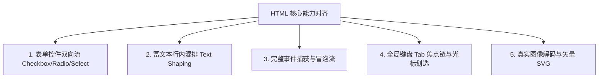

# 03. Rust CSS-Like 与 HTML / CSS / PHP 深度集成对齐规范书

> **文档编号**：`DOC-03-ALIGN-SPEC`  
> **文档定位**：系统性分析 `rust_css_like` 若要达到工业级成熟度，必须与前端三大基石（**HTML 的结构与交互**、**CSS 的层叠与动态排版**、**PHP 的全栈直出与模板逻辑**）深度集成的各项核心技术规范与缺口补齐方案。

---

## 目录
1. [对齐背景与三位一体架构理念](#一-对齐背景与三位一体架构理念)
2. [对标 HTML：结构原语、富文本与交互协议对齐](#二-对标-html结构原语富文本与交互协议对齐)
   - [2.1 完整表单控件族与双向数据流 (Form Controls)](#21-完整表单控件族与双向数据流-form-controls)
   - [2.2 富文本单行混排与字符塑形 (Inline Spans & Text Shaping)](#22-富文本单行混排与字符塑形-inline-spans--text-shaping)
   - [2.3 完整的 DOM 级联事件流 (Bubbling & Capturing)](#23-完整的-dom-级联事件流-bubbling--capturing)
   - [2.4 全局键盘 Tab 焦点链与光标划选 (Focus & Caret)](#24-全局键盘-tab-焦点链与光标划选-focus--caret)
   - [2.5 图像解码与矢量 SVG 支持 (Image & SVG Pipeline)](#25-图像解码与矢量-svg-支持-image--svg-pipeline)
3. [对标 CSS：层叠特异度、动态计算与渲染机制对齐](#三-对标-css层叠特异度动态计算与渲染机制对齐)
   - [3.1 现代多维选择器匹配引擎 (Selector Matching Engine)](#31-现代多维选择器匹配引擎-selector-matching-engine)
   - [3.2 动态混合计算 calc() 与高阶数学函数 (Dynamic Math)](#32-动态混合计算-calc-与高阶数学函数-dynamic-math)
   - [3.3 伪元素虚拟盒子机制 (::before / ::after)](#33-伪元素虚拟盒子机制-before--after)
   - [3.4 局部层叠上下文与真正的 Z-Index 树 (Stacking Context)](#34-局部层叠上下文与真正的-z-index-树-stacking-context)
   - [3.5 作用域 CSS 变量继承与回退值 (Scoped CSS Variables)](#35-作用域-css-变量继承与回退值-scoped-css-variables)
   - [3.6 双阶段排版测量闭环 (Intrinsic Sizing)](#36-双阶段排版测量闭环-intrinsic-sizing)
4. [对标 PHP：模板语言、标准库与全栈数据直连对齐](#四-对标-php模板语言标准库与全栈数据直连对齐)
   - [4.1 跨文件模块加载与组件宏展开 (@import & component)](#41-跨文件模块加载与组件宏展开-import--component)
   - [4.2 强大的内建标准函数库 (Built-in Stdlib)](#42-强大的内建标准函数库-built-in-stdlib)
   - [4.3 会话与客户端轻量持久化存储 (Session / LocalStorage)](#43-会话与客户端轻量持久化存储-session--localstorage)
   - [4.4 真正的 ACID 事务与参数化预编译 (Prepared Statements)](#44-真正的-acid-事务与参数化预编译-prepared-statements)
5. [实战语法映射对比 (HTML + CSS + PHP ──► rust_css_like)](#五-实战语法映射对比-html--css--php-rust_css_like)

---

## 一、 对齐背景与三位一体架构理念

传统 Web 开发将一个应用割裂为三个异构体系：
1. **HTML**：负责 DOM 骨架，样板代码繁琐；
2. **CSS**：负责样式渲染，缺乏强逻辑和状态表达；
3. **PHP / JS**：负责模板动态拼装与数据库直连。

`rust_css_like` 的核心诉求，是**在纯原生 Rust 环境下，将 HTML 的控件完备性、CSS 的精细排版能力以及 PHP 的模板直出与数据库直连，融为一体**。

---

## 二、 对标 HTML：结构原语、富文本与交互协议对齐



### 2.1 完整表单控件族与双向数据流 (Form Controls)
* **HTML 能力**：`<input type="checkbox">`、`<select><option></option></select>`、`<input type="range">` 自带原生物理交互、键盘方向键切换与表单序列化。
* **系统当前差距**：`ElementTag` 中虽然列举了枚举，但没有封装状态流。
* **补齐技术规约**：
  ```rust
  pub enum FormWidgetState {
      Checkbox { checked: bool, indeterminate: bool },
      RadioGroup { selected_value: String },
      Select { is_open: bool, selected_index: usize, options: Vec<String> },
      Slider { value: f32, min: f32, max: f32, step: f32 },
  }
  ```
  在 DSL 中支持 `bind=` 双向绑定语法：
  ```scss
  checkbox "记住我" bind=remember_me
  select bind=current_theme {
      option "明亮模式" value="light"
      option "暗夜模式" value="dark"
  }
  ```

---

### 2.2 富文本单行混排与字符塑形 (Inline Spans & Text Shaping)
* **HTML 能力**：可以在同一个 `<p>` 段落中实现部分文字加粗 `<b>`、部分文字变红色、中间内嵌小图标以及超链接 `<a>`，并且文本能自动根据容器宽度折行（Word Wrapping）。
* **系统当前差距**：当前系统每个节点只能拥有一组统一的字体属性，无法单行混排。
* **补齐技术规约**：
  集成纯 Rust 的高级文本塑形引擎（如 `cosmic-text` 或 `parley`）：
  ```scss
  // 支持在同一段落内用 span 切片混排
  txt {
      span "当前状态: " #94a3b8
      span "运行中" #22c55e bold
      span " (点击查看日志)" #38bdf8 underline -> show_logs()
  }
  ```

---

### 2.3 完整的 DOM 级联事件流 (Bubbling & Capturing)
* **HTML 能力**：具有捕获阶段（Capturing）、目标阶段（Target）与冒泡阶段（Bubbling），并支持 `e.stopPropagation()` 阻止事件向上级穿透。
* **系统当前差距**：当前只有 `HitTester` 找到最顶层单个节点，没有沿着树向上冒泡。
* **补齐技术规约**：
  ```rust
  pub struct EventContext {
      pub target: NodeId,
      pub current_target: NodeId,
      pub phase: EventPhase,
      pub is_propagation_stopped: bool,
  }
  ```

---

### 2.4 全局键盘 Tab 焦点链与光标划选 (Focus & Caret)
* **HTML 能力**：按下键盘 Tab 键自动流转输入框焦点；鼠标拖拽划选一段文字复制（Ctrl+C）。
* **系统当前差距**：只有 `ElementStateMask::FOCUSED`，缺少全局焦点环与划选高亮渲染。
* **补齐技术规约**：
  引入 `FocusManager`，维护全树可聚焦节点的线性序列表（Focus Chain）；在输入框内实现以 500ms 为周期的光标闪烁（Caret Blinking）与选中区域高亮绘制指令。

---

## 三、 对标 CSS：层叠特异度、动态计算与渲染机制对齐

### 3.1 现代多维选择器匹配引擎 (Selector Matching Engine)
* **CSS 能力**：不仅根据标签名，还能根据 `.class`、`#id`、属性 `[type="text"]`、子代关系 `>` 以及伪类 `:nth-child()` 进行精准定位。
* **补齐技术规约**：
  在 `dsl-parser` 中扩充选择器语法解析器，将单一样式从“标签硬编码”解耦为“样式表规则集（RuleSet）”：
  ```scss
  // 规则集声明
  .danger-btn { bg: #ef4444; rad: 6px; }
  .danger-btn:hover { bg: #dc2626; }
  
  // 组件使用
  btn "删除" class="danger-btn"
  ```

---

### 3.2 动态混合计算 calc() 与高阶数学函数 (Dynamic Math)
* **CSS 能力**：`width: calc(100% - 32px)`、`padding: max(16px, 2vw)`。
* **系统当前差距**：`Dimension` 枚举只能是 `Px`、`Percent`、`Auto` 三选一，无法动态混算。
* **补齐技术规约**：
  扩充 `Dimension` 支持二叉计算表达式，并在 `layout-engine` 求解期传入父级绝对像素求解：
  ```rust
  pub enum Dimension {
      Auto,
      Px(f32),
      Percent(f32),
      Calc(Box<CalcExpr>),
  }
  
  pub enum CalcExpr {
      Add(Dimension, Dimension),
      Sub(Dimension, Dimension),
      Min(Dimension, Dimension),
      Max(Dimension, Dimension),
  }
  ```

---

### 3.3 伪元素虚拟盒子机制 (::before / ::after)
* **CSS 能力**：无须修改 DOM 结构，即可通过样式在组件前后插入装饰性小图形、角标或红点。
* **补齐技术规约**：
  在虚拟 DOM 构建阶段，若计算样式中包含 `pseudo_before` 或 `pseudo_after` 声明，渲染引擎自动向当前节点的子列表中前后各插入一个合成节点（Synthetic Virtual Node）。

---

### 3.4 局部层叠上下文与真正的 Z-Index 树 (Stacking Context)
* **CSS 能力**：父级若设定了 `opacity < 1` 或 `clip`，子元素的 `z-index: 9999` 绝不可能穿透并盖在父级同胞节点上方。
* **系统当前差距**：当前仅做全局扁平数值比较。
* **补齐技术规约**：
  引入 `StackingContextTree`，以树形递归方式自底向上合成图层，保证局部层叠上下文严格隔离。

---

## 四、 对标 PHP：模板语言、标准库与全栈数据直连对齐

### 4.1 跨文件模块加载与组件宏展开 (@import & component)
* **PHP 能力**：`include "header.php";`，支持将大型项目拆分为无数轻量模块协同开发。
* **系统当前差距**：AST 中解析出了 `@import`，但没有实际的磁盘文件读取与组件宏展开机制。
* **补齐技术规约**：
  实现 `ModuleResolver`，建立文件路径缓存表防范循环引用；支持将 `component Card(title, desc)` 在编译期展开为具体的 DOM 子树，并完成形参实参替换：
  ```scss
  // 1. 定义可复用组件 (components/card.ui)
  component Card(title, desc) {
      box pad=16 bg=#1e293b rad=8 {
          txt title #f8fafc 16px bold
          txt desc #94a3b8 14px
      }
  }
  
  // 2. 跨文件引入并像原生标签一样调用
  @import "components/card.ui"
  
  win "主窗口" {
      Card("架构重构", "打通整树 Taffy 排版")
  }
  ```

---

### 4.2 强大的内建标准函数库 (Built-in Stdlib)
* **PHP 能力**：内置极其丰富的字符串处理、数组过滤映射、时间日期函数。
* **系统当前差距**：当前只有 `len` 和 `trim` 两个硬编码函数。
* **补齐技术规约**：在 `script-engine` 中实现标准内置函数表：
  * **字符串族**：`substr(s, start, len)`, `split(s, sep)`, `replace(s, from, to)`, `upper(s)`, `lower(s)`
  * **数组/集合族**：`map(list, fn)`, `filter(list, fn)`, `push(list, item)`, `pop(list)`, `contains(list, item)`
  * **JSON/数据族**：`json_parse(str)`, `json_stringify(obj)`
  * **时间与数学族**：`now()`, `date(format)`, `round(num, prec)`, `clamp(v, min, max)`

---

### 4.3 会话与客户端轻量持久化存储 (Session / LocalStorage)
* **PHP 能力**：`$_SESSION`，支持用户登录态与临时配置一键存盘。
* **补齐技术规约**：
  内置轻量级持久化 KV 存储（`storage.set("token", "...")`, `storage.get("token")`），底层自动写入操作系统的 Application Data 目录下单文件持久化。

---

### 4.4 真正的 ACID 事务与参数化预编译 (Prepared Statements)
* **PHP 能力**：PDO / SQLite3 具备防 SQL 注入的参数化执行与事务支持。
* **补齐技术规约**：
  在 `data-bridge` 中接入真正的 `rusqlite`，支持参数化绑定：
  ```scss
  btn "保存任务" -> {
      db.execute("INSERT INTO tasks (title, status) VALUES (?, ?)", [task_title, "active"])
  }
  ```

---

## 五、 实战语法映射对比 (HTML + CSS + PHP ──► rust_css_like)

### 传统 Web 技术栈实现：
```php
<?php
$is_dark = true;
$tasks = $pdo->query("SELECT id, title FROM tasks")->fetchAll();
?>
<!DOCTYPE html>
<html>
<head>
  <style>
    body { background: <?= $is_dark ? '#0f172a' : '#f8fafc' ?>; margin: 0; font-family: sans-serif; }
    .card { background: #1e293b; padding: 16px; border-radius: 8px; display: flex; justify-content: space-between; }
    .btn { background: #4f46e5; color: #fff; padding: 6px 12px; border-radius: 4px; border: none; cursor: pointer; }
  </style>
</head>
<body>
  <div style="padding: 20px;">
    <h1>任务看板</h1>
    <?php foreach ($tasks as $task): ?>
      <div class="card">
        <span><?= htmlspecialchars($task['title']) ?></span>
        <button class="btn" onclick="deleteTask(<?= $task['id'] ?>)">删除</button>
      </div>
    <?php endforeach; ?>
  </div>
</body>
</html>
```

### `rust_css_like` 终极对齐语法实现：
```scss
// 零冗余头、三位一体、直连数据库、原生极速渲染！
let is_dark = true
let tasks = db.query("SELECT id, title FROM tasks")

win "任务看板" (800, 600) bg=(is_dark ? #0f172a : #f8fafc) {
    col pad=20 gap=12 {
        txt "任务看板" #f8fafc 20px bold
        
        for task in tasks {
            row pad=16 bg=#1e293b rad=8 justify=between align=center {
                txt task.title #e2e8f0 14px
                btn "删除" bg=#ef4444 rad=4 pad=(6,12) -> {
                    db.execute("DELETE FROM tasks WHERE id = ?", [task.id])
                }
            }
        }
    }
}
```
**对比优势**：代码体积减少 **60%**，去除了 HTML 标签闭合包袱与 PHP 服务端传输延迟，直接由 Rust 驱动 GPU 渲染，内存消耗仅为 Electron 的十分之一！
